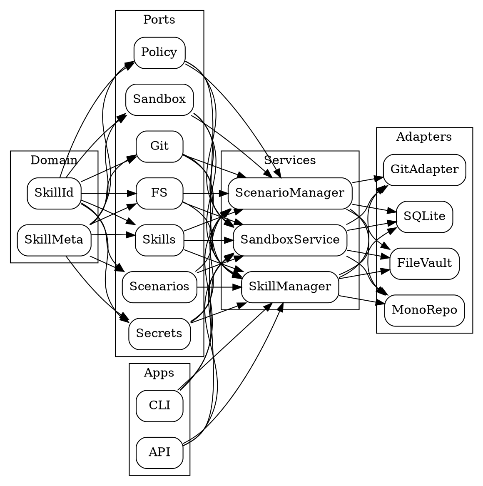

# Архитектура AdaOS

Архитектура AdaOS построена по слоям и ориентирована на принцип **«минимальное ядро, максимум на краях»**.  
Сервисы используют только необходимые **порты**, а интеграции выносятся в адаптеры.

---

## Слои одним взглядом

- **Domain** — базовые сущности (SkillId, SkillMeta).  
- **Ports** — протоколы интерфейсов (Git, FS, Sandbox, Policy, Skills, Scenarios).  
- **Services** — бизнес-логика (SkillManager, ScenarioManager, политики, sandbox).  
- **Adapters** — реализации портов (git, sqlite, keyring, fs, runtime).  
- **Apps** — CLI, API и bootstrap.  
- **SDK** — утилиты и совместимость.  
- **Integrations** — внешние проекты (Inimatic, Rhasspy, OVOS).  

---

## Общая схема



---

## AgentContext

Собирается в `apps/bootstrap.py` и включает:

- **settings** — параметры запуска (profile, base\_dir, монорепо).
- **paths** — провайдер путей (skills, scenarios, cache, logs).
- **bus, proc** — событийная шина и процесс-менеджер.
- **caps, net, fs** — политики (Capabilities, сетевые, файловые).
- **sql, kv** — хранилища SQLite/KeyValue.
- **git** — SecureGitClient.
- **secrets** — SecretsService (keyring + файловый фолбэк).
- **sandbox** — SandboxService.

---

## Документация по слоям

- [Слои и контракты](layers.md)
- [AgentContext](context.md)
- [Безопасность и доверие](security.md)

```
