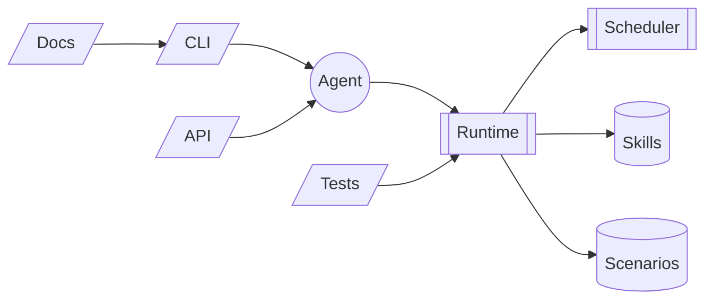

# Архитектура

```mermaid
flowchart LR
  Agent((Agent))
  Runtime[[Runtime]]
  Scheduler[[Scheduler]]
  CLI[/CLI/]
  API[/API/]
  Tests[/Tests/]
  Docs[/Docs/]
  Skills[(Skills)]
  Scenarios[(Scenarios)]

  Agent --> Runtime --> Scheduler
  CLI --> Agent
  API --> Agent
  Tests --> Runtime
  Docs --> CLI
  Runtime --> Skills
  Runtime --> Scenarios
```
