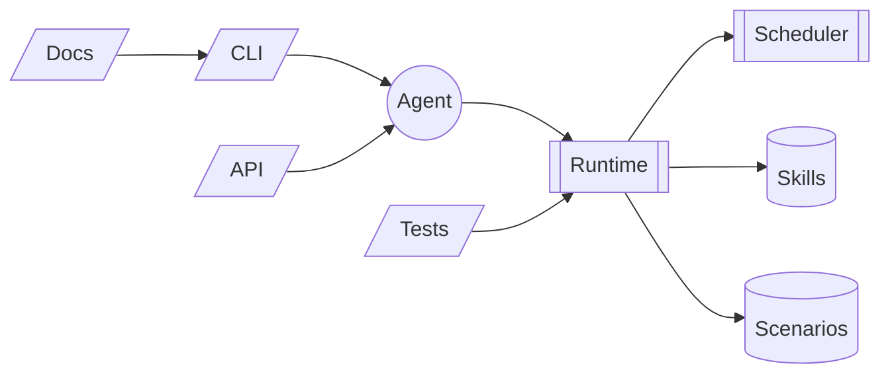

# Архитектура

## Обзор слоёв

* **Ports** (`src/adaos/ports/*`) — минимальные протоколы интерфейсов (Git, SQL, KV, Paths, Secrets, Policy, FS, Skills/Scenarios).
* **Adapters** (`src/adaos/adapters/*`) — реализации портов (CLI Git, SecureGit, SQLite, SQLiteKV, Keyring/FileVault, PathProvider, Mono-репозитории).
* **Services** (`src/adaos/services/*`) — бизнес-логика и политики: менеджеры навыков/сценариев, Capabilities, NetPolicy, FSPolicy, SecretsService, безопасные FS-утилиты.
* **Apps** (`src/adaos/apps/*`) — bootstrap (сборка `AgentContext`) и CLI (Typer).
* **SDK** (`src/adaos/sdk/*`) — тонкие обёртки для совместимости старых скриптов и dev-утилит (часть команд временно помечена как deferred).

## AgentContext (состав)

Собирается в `apps/bootstrap.py`. Содержит:

* `settings` — параметры запуска (base\_dir, profile, монорепо…)
* `paths` — провайдер путей (base, skills\_dir, scenarios\_dir, state, cache, logs)
* `bus`, `proc` — событийная шина и процесс-менеджер (локальные реализации)
* `caps` — Capabilities (выдача/проверка прав)
* `net` — NetPolicy (allow-list доменов)
* `fs` — FSPolicy (разрешённые корни в ФС)
* `sql`, `kv` — SQLite + SQLiteKV
* `git` — SecureGitClient (поверх CLI Git)
* `secrets` — SecretsService (keyring + файловый фолбэк)

> Принцип: сервисам передаются **только нужные порты**, а не весь контекст.

## Ключевые порты и адаптеры

* Git: `ports/git` → `adapters/git/cli_git.py`, `adapters/git/secure_git.py`
* Политики: `ports/policy` → `services/policy/{capabilities,net}.py`
* ФС: `ports/fs` → `services/policy/fs.py`, безопасные операции `services/fs/safe_io.py`
* Секреты: `ports/secrets` → `adapters/secrets/{keyring_vault,file_vault}.py` + `services/secrets/service.py`
* Навыки: `ports/skills` → `adapters/skills/mono_repo.py` + `services/skill/manager.py`
* Сценарии: `ports/scenarios` → `adapters/scenarios/mono_repo.py` + `services/scenario/manager.py`
* БД: `adapters/db/sqlite_store.py` (SQLite/SQLiteKV), `adapters/db/sqlite_skill_registry.py` (реестры)

## Репозитории и реестры

* **Skills** и **Scenarios** — каждый в своём **моно-репозитории** (один git working tree на категорию).
* Источник истины: **SQLite** таблички `skills` / `scenarios` (+ версии).
* Рабочее дерево подтягивается **через git sparse-checkout** по списку из БД.

## Политики/безопасность — как это работает

По умолчанию core получает secrets.read/secrets.write. Если потом появятся скиллы, которым нельзя читать все секреты — заведём subject="skill:<id>" и выдадим ограниченный набор ключей (это легко расширить в SecretsService).

CLI никогда не пишет значения секретов в логи/события; только в stdout по --show.

Основной бэкенд — OS keyring; если он недоступен (CI/минимальная ОС), падаем в FileVault с шифрованием Fernet и мастер-ключом из keyring/ENV.

## Правило для MVP

* Вся исполнение и состояние — в services.
* Вся интеграция — в adapters.
* CLI и автотесты — поверх services.
* sdk — удобные фасады и утилиты для разработчиков навыков/сценариев, никаких прямых зависимостей на хранилища/гит/секреты.
