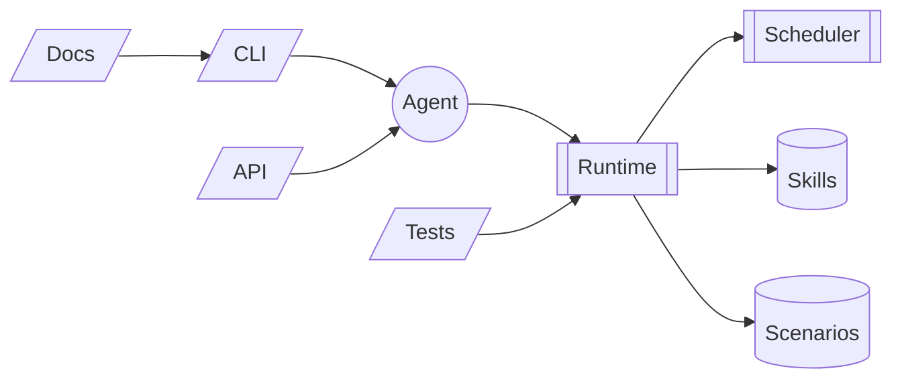

# Архитектура

## Политики/безопасность — как это работает

По умолчанию core получает secrets.read/secrets.write. Если потом появятся скиллы, которым нельзя читать все секреты — заведём subject="skill:<id>" и выдадим ограниченный набор ключей (это легко расширить в SecretsService).

CLI никогда не пишет значения секретов в логи/события; только в stdout по --show.

Основной бэкенд — OS keyring; если он недоступен (CI/минимальная ОС), падаем в FileVault с шифрованием Fernet и мастер-ключом из keyring/ENV.
