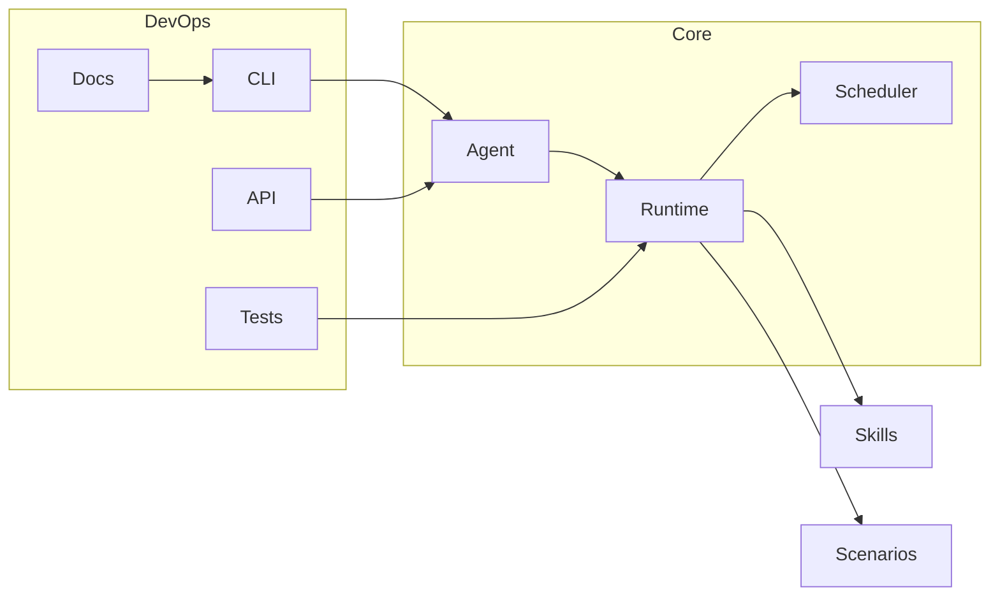

# AdaOS

> «Мультиагентная многопользовательская ОС навыков и сценариев» — минимализм ядра, максимум гибкости на краях.

!!! tip "зачем читать"
    быстро понять архитектуру, запустить демо, написать первый навык/сценарий и подключить LLM как разработчика.

## что такое AdaOS

AdaOS — это платформа для управления **навыками** (skills) и **сценариями** (scenarios) с упором на DevOps, интерпретируемость и кросс-ОС.

## архитектура одним взглядом

