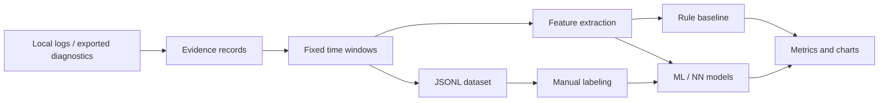
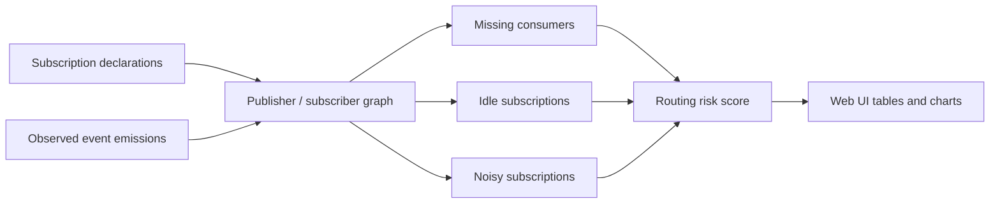
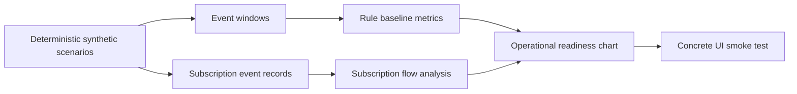
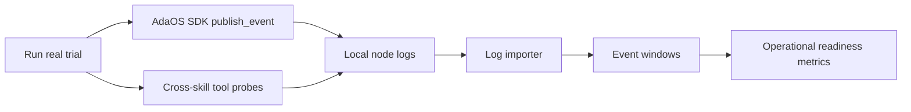
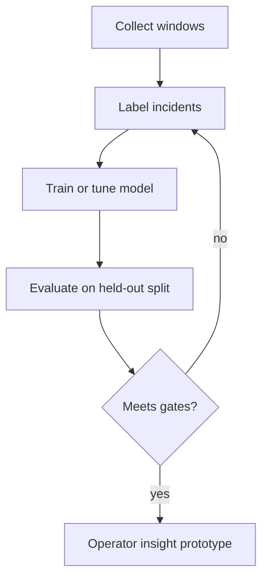

# AI Event Analysis Skill

`ai_event_analysis_skill` is a student-facing research and prototype skill for
measuring whether AI/ML methods improve operational event analysis in AdaOS.

The first iterations do not change AdaOS core. The skill uses the existing
declarative Web UI ABI, local file import, event-window samples, and a
deterministic rule-based baseline so the research task has a measurable starting
point without blocking core branches.

## Problem Statement

AdaOS is moving toward an operational event model where runtime, platform,
skill, browser, projection, and diagnostic signals are emitted as explicit
events and materialized through demanded projections.

The research task is to build and evaluate a model that analyzes a window of
operational events and predicts:

- whether the window contains an incident;
- the incident class;
- severity;
- confidence;
- the most important contributing signals.

The model must be evaluated against simple baselines instead of being judged by
subjective usefulness alone.

The current prototype also includes **Subscription Flow Analysis**. This mode
looks at the event routing layer itself: declared subscriptions, observed event
types, publisher/subscriber edges, missing consumers, idle subscriptions, noisy
subscriptions, and a compact routing risk score. It is intended to reveal
whether the operational event model is observable enough to tune filters,
fanout, throttling, and subscription ownership.

The local AdaOS fork additionally includes **Projection Relevance Agent**. This
mode is an advisory ML layer for the demand-driven event model. It trains a
multi-label sigmoid classifier on a synthetic event/subscription dataset and
predicts which demanded `projection_key` values should be refreshed for a new
operational event. The agent is deliberately outside the critical delivery
path: it recommends refresh priority and action, while the guarded dispatcher,
demand registry, authorization, and projection lifecycle remain authoritative.

For the first reproducible MVP the agent compares a trained model with a broad
rule-based dispatcher. The measured result includes precision, recall, F1,
`precision_at_3`, `recall_at_3`, Hamming loss, write-reduction ratio, and missed
critical projections. This gives the student-facing research task an actual
trained model and a measurable baseline without requiring production logs or
neural dependencies in the runtime.

## Student Assignment

Title:

> Machine learning methods for anomaly detection and incident classification in
> the AdaOS operational event model.

Goal:

> Build a prototype that classifies operational event windows, compare a neural
> or classical ML approach with a rule-based baseline, and evaluate quality with
> reproducible metrics.

Input unit:

```json
{
  "window_id": "run-001:120-180s",
  "features": {
    "event_total": 128,
    "error_total": 8,
    "drop_total": 3,
    "projection_refresh_total": 42,
    "same_projection_refresh_max": 31,
    "yjs_write_total": 12,
    "browser_reconnect_total": 1,
    "member_disconnect_total": 0
  },
  "label": {
    "incident": true,
    "incident_type": "projection_refresh_storm",
    "severity": "warning",
    "reasons": ["same_projection_refresh_max", "projection_refresh_total"]
  }
}
```

Output unit:

```json
{
  "incident": true,
  "incident_type": "projection_refresh_storm",
  "severity": "warning",
  "confidence": 0.86,
  "reasons": ["same_projection_refresh_max", "projection_refresh_total"]
}
```

## Implementation Plan

### Phase 0. Skill Boundary

- [x] Keep all implementation inside `ai_event_analysis_skill`.
- [x] Avoid AdaOS core and core documentation changes in this branch.
- [x] Use only existing Web UI widgets and stream receivers.
- [x] Keep live stream publication best-effort so tools stay testable outside a
  running AdaOS runtime.

### Phase 1. Dataset Schema

- [x] Define `EventEvidenceRecord`, `EventWindowRecord`, labels, features, and
  prediction output.
- [x] Document privacy boundaries and redaction requirements.
- [x] Treat `node_id`, `subnet_id`, and `webspace_id` as dataset scope fields.
- [ ] Add schema-version migration checks when persisted datasets evolve.

See [Dataset Schema](docs/dataset-schema.md).

### Phase 2. Local Data Acquisition

- [x] Add `import_local_logs` for explicit log-file import.
- [x] Add safe local candidate discovery for common `.adaos` log locations.
- [x] Redact tokens, secrets, authorization headers, and local paths from log
  evidence.
- [x] Normalize local log lines into evidence records with timestamp, topic,
  severity, source, and message.
- [ ] Add import from `infrastate.events.recent` export files.
- [ ] Add import from reliability/status/projection snapshot exports.
- [ ] Add optional multi-node bundle import, where each node contributes its
  own evidence file with explicit `node_id`.

### Phase 3. Windowing And Features

- [x] Add `build_event_windows`.
- [x] Slice evidence into fixed time windows.
- [x] Compute basic feature families: event count, error count, eventbus
  pressure, projection refresh pressure, Yjs activity, browser reconnects,
  member disconnects, and runtime rebuild churn.
- [x] Attach top redacted evidence lines to each window.
- [x] Add baseline prediction to every imported unlabeled window.
- [x] Add weak labels for real-log windows so the current rule baseline can be
  measured before manual review exists.
- [ ] Add burst features such as max/sec, p95/sec, and repeated topic streaks.
- [ ] Add sequence features for ordered event-topic patterns.
- [ ] Add topology features for hub/member/subnet role.

### Phase 4. Dataset Export And Labeling

- [x] Add `export_event_windows_jsonl`.
- [x] Store exported datasets as JSONL by default under the skill data folder.
- [x] Add a Web UI `Windows` view for inspecting event-window rows.
- [ ] Add Web UI labeling actions for `incident_type`, severity, and reason
  codes.
- [ ] Add review state: unlabeled, reviewed, accepted, rejected.
- [ ] Add inter-annotator agreement metrics if several students/operators label
  the same dataset.

### Phase 5. Baselines And Metrics

- [x] Add a deterministic synthetic dataset for the first iteration.
- [x] Add a deterministic synthetic trial suite that exercises normal, incident, and
  subscription-routing cases.
- [x] Add a real trial that emits AdaOS SDK events, calls lightweight tools from
  existing skills, reads local node logs back, and builds event windows from the
  resulting log records.
- [x] Implement a rule-based baseline classifier.
- [x] Compute accuracy, macro-F1, per-class precision/recall/F1, false positive
  rate, critical recall, detection delay, and top-reason hit rate.
- [x] Publish evaluation results through an existing stream receiver.
- [x] Project real-log weak-label metrics into the same Web UI tables and
  charts while keeping the synthetic demo available.
- [ ] Add threshold tuning for the rule baseline.
- [ ] Add train/test split support for imported datasets.

### Phase 6. ML And Neural Models

- [ ] Add a classical ML baseline, for example logistic regression, random
  forest, or gradient boosting.
- [ ] Add model-card output with dataset version, feature set, split, and
  metrics.
- [ ] Add a neural sequence/window model, for example MLP, GRU/LSTM, or a small
  Transformer encoder.
- [ ] Compare all models against the same rule baseline.
- [ ] Add top-feature or top-signal explanations for every prediction.

### Phase 7. Operator Insight Prototype

- [x] Add operational readiness chart based on classification, critical recall,
  normal precision, reason quality, routing health, and consumer coverage.
- [x] Add event-volume chart by event window.
- [x] Add class-distribution chart for baseline predictions.
- [x] Add a `Subscriptions` Web UI view for event publisher/subscriber flow.
- [ ] Group related windows into incident candidates.
- [ ] Generate operator summaries from incident candidates.
- [ ] Suggest the next diagnostic surface, such as logs, Yjs pressure, runtime
  reliability, or device inventory.
- [ ] Publish demanded `ai-summary:*` projections after the operational-event
  MVP gate accepts the canonical runtime path.

### Phase 8. Subscription Flow Analysis

- [x] Parse `skill=... subscriptions=[event: handler]` log lines into
  subscription declarations.
- [x] Parse observed event emissions from structured log lines.
- [x] Build publisher/subscriber edge rows with event volume, fanout, state, and
  risk.
- [x] Detect `missing_consumer`, `idle`, and `noisy` subscription states.
- [x] Project subscription summary, edge table, metrics, and event-volume chart
  into Yjs.
- [ ] Add latency and handler-duration metrics when event delivery logs expose
  correlation ids and timings.
- [ ] Add suggested filter changes for overbroad subscriptions.
- [ ] Add before/after simulation for throttling, coalescing, and debounce
  policies.

### Phase 9. Trial Suites For Useful First-Run Data

- [x] Add `run_trial_suite` as a deterministic workload.
- [x] Cover normal idle/busy windows, eventbus backpressure, projection refresh
  loops, Yjs pressure, browser reconnects, member disconnects, runtime rebuild
  churn, and combined pressure.
- [x] Generate subscription-flow records with active, idle, noisy, and missing
  consumer cases.
- [x] Project the trial result into the same dataset, window, metric,
  subscription, and chart surfaces as real logs.
- [x] Add `run_real_trial` to publish real AdaOS events, call cross-skill
  probes, and analyze the log records written by the local node.
- [ ] Add scenario runners that execute real AdaOS UI/API workflows and collect
  resulting logs.
- [ ] Persist scenario run metadata so trial datasets can be compared across
  commits.

### Phase 10. Projection Relevance Agent

- [x] Add a synthetic event/subscription generator for AdaOS projection demand.
- [x] Add a rule oracle for target `projection_key` labels.
- [x] Train a deterministic multi-label sigmoid model without external ML
  dependencies.
- [x] Compare the trained model with a broad rule-based dispatcher.
- [x] Return an advisory refresh plan with confidence scores and guardrail text.
- [x] Project compact experiment results through the existing experiments
  surface.
- [x] Add a readiness summary with metric gates, advisory boundary, and demo
  refresh plan.
- [ ] Add persisted train/test splits for comparing several model versions.
- [ ] Add a deeper MLP or sequence model after real scenario datasets become
  available.

## Data Collection Strategy

Start with local logs and exported diagnostic snapshots. That gives real
operational texture without requiring a core change or a cross-node collector.

Recommended progression:

1. Local node datasets from `.adaos` logs and dev/test incidents.
2. Hub plus member-node bundles for subnet and remote-runtime classes.
3. Multi-subnet datasets only after privacy, redaction, and scope metadata are
   stable.

Multi-node data is useful because browser reconnects, member disconnects, Yjs
pressure, and update/rebuild churn can look similar in aggregate counts. The
dataset should keep `node_id`, `subnet_id`, and `webspace_id` explicit so a
model can learn topology-sensitive differences without mixing ownership.

The skill should not ingest raw secrets, full local paths, bearer tokens, or
large log bodies into training data. The default importer stores redacted
evidence excerpts plus aggregate features.

## Observability Health Strategy

The useful first milestone is not a neural classifier. It is a trustworthy
data-engineering and observability layer:

- normalize core, API, browser/YWS, YJS, projection, eventbus, and skill logs
  into compact event records;
- measure schema coverage: timestamp, event type, source/logger, and
  correlation id coverage;
- measure runtime health: slow tool calls, slow event handlers, event loop lag,
  runtime errors, and service failures;
- measure projection and browser health: YJS owner-flow warnings,
  blocked/throttled writes, materialization repairs, and browser reconnect
  bursts;
- evaluate invariants before model metrics: event type coverage, source
  coverage, correlation coverage, zero blocked writes, zero slow handlers, and
  zero event-loop lag warnings.

Labeling should start from invariant violations rather than model guesses.
Each detected issue becomes a weak label candidate, for example
`projection_write_blocked`, `slow_event_handler`,
`runtime_event_loop_lag`, or `browser_session_instability`. Operators or
students then accept/reject these candidates and attach a cause. Only after
that review loop exists should ML/NN models be trained against held-out data.

## Pipeline Diagram



## Subscription Flow Diagram



## Trial Suite Diagram



## Real Trial Diagram



## Evaluation Loop



## Success Criteria

Minimum first research milestone:

- dataset has at least 500 labeled windows;
- at least 5 incident classes plus `normal`;
- rule-based baseline is implemented and reproducible;
- ML/NN model is compared against the rule baseline;
- macro-F1 is at least `0.75` on a held-out test split;
- recall for critical incidents is at least `0.85`;
- false positive rate for normal windows is at most `0.15`;
- every prediction returns top contributing signals.

Stretch target:

- improve macro-F1 by at least `10%` relative to the rule baseline, or reduce
  average detection delay by at least `20%` at the same false-positive rate.

## Current Prototype

The skill currently ships:

- a synthetic benchmark dataset generator;
- a deterministic synthetic trial suite for useful first-run data;
- a real-trial runner that emits AdaOS events, calls selected tools from other
  installed skills, and analyzes local node logs;
- observability health analysis for normalized logs, schema coverage, runtime
  health, projection/YJS health, browser/session health, and invariant-based
  weak labels;
- local log import into redacted evidence records;
- fixed-window feature extraction;
- JSONL event-window export;
- a reviewed-heuristic real-log dataset exported as
  `data/reviewed_event_windows.jsonl`;
- a deterministic rule baseline;
- metric computation utilities;
- a Web UI app named `AI Event Analysis`;
- a `Windows` inspection view;
- a `Subscriptions` inspection view;
- operational readiness, event-volume, and class-distribution charts;
- subscription summary, publisher/subscriber edge table, and event-type volume
  chart;
- a live stream receiver for demo evaluation and dataset-building results.

Use cases now supported:

1. `Run demo baseline` keeps the small synthetic benchmark available for quick
   regression checks.
2. `Run synthetic trial` populates every important table and chart with a
   diverse, deterministic in-memory workload. This is the best first action when
   local logs do not contain enough incidents.
3. `Run real trial` emits real AdaOS SDK events, calls lightweight tools from
   `demo_metrics_skill`, `browsers_skill`, `infrascope_skill`, `subnet_env`, and
   `pair_new_device_skill`, waits briefly, imports local node logs, and builds
   event windows from the log records that were actually written. This validates
   the event/log/tool/projection path, but it is still a controlled local trial
   rather than a physical ReDevice admission run.
4. `Analyze real logs` builds event windows from available AdaOS logs and
   compares the rule baseline with reviewed heuristic labels.
5. `Analyze subscriptions` checks whether observed event emissions match
   declared subscribers in the sampled logs.

The right-side quality graph was changed from `Weak-label baseline quality` to
`Operational readiness`. The new chart is intended to answer an operator-facing
question: how ready the current event model is for incident classification and
subscription routing review. On the `Subscriptions` tab the baseline chart is
hidden, so the visible graph describes event-type volume for the subscription
flow being inspected.

Latest local reviewed-heuristic run:

- `1993` imported evidence records;
- `78` one-minute event windows;
- `accuracy = 0.987`;
- `macro-F1 = 0.714`;
- `critical_recall = 0.750`;
- `normal false-positive rate = 0.000`.

These metrics are useful for prototyping but are not final ground truth. The
label source is `codex_reviewed_log_heuristic`; the next quality gate is manual
review and acceptance/rejection of event-window labels.

Latest local subscription-flow run:

- `1993` imported evidence records;
- `8` declared subscriptions observed in logs;
- `4` observed event types;
- `3` event types with no observed subscriber in the sampled logs;
- `7` idle subscriptions in the sampled logs;
- routing risk score `1.0`.

The subscription-flow numbers are sample-sensitive because they are inferred
from available logs, not from a canonical event-routing journal. They are useful
as an observability check: the current logs expose subscription declarations and
event emissions, but they do not yet provide enough delivery, ack, latency, and
correlation metadata to prove whether a subscription is truly unused or merely
inactive in the selected sample.

The prototype now includes deterministic model training for the projection
relevance agent. The current quality gate is advisory readiness: the model must
beat the broad rule baseline, reduce redundant refresh recommendations, and
miss zero critical diagnostic projections. The next research step is to replace
or calibrate the synthetic training set with reviewed AdaOS event/subscription
logs and then compare several model versions on persisted train/test splits.
